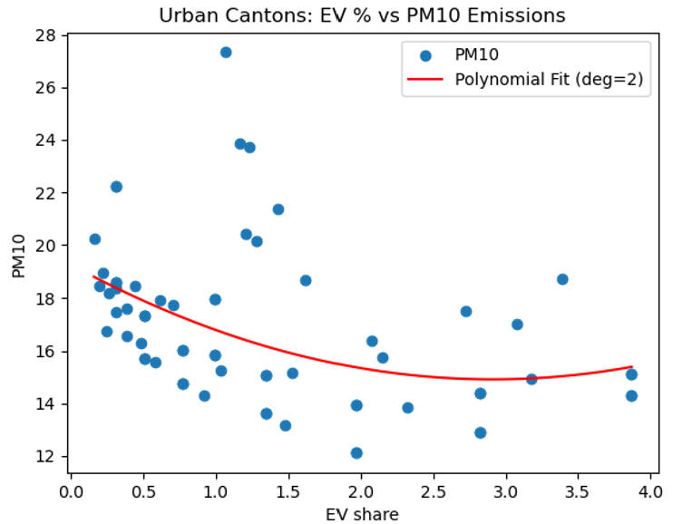
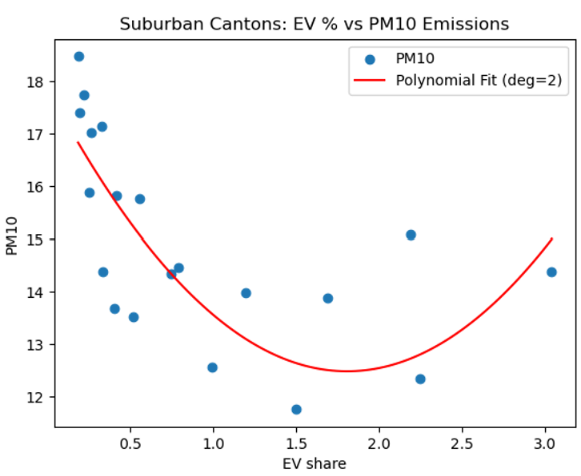

# Project Summary
## Video link
Please follow the link to the video: [Link](https://youtu.be/JGLpjJL7K5s)! 

## Executive Summary
This project aimed to investigate a link between Electric Vehicles (EVs), air quality and environmental metrics. We used Data Science and Machine Learning methods to model the relationship between EVs and air/climate metrics in Switzrerland. The analysis first focuses on the national level, then we try to support the findings throughout cantonal analysis. 

## Data
The different databases mainly comes from Federal and Cantonal websites.
- [CO2 national](https://www.bafu.admin.ch/bafu/fr/home/themen/thema-klima/klima--daten--indikatoren-und-karten/klima--indikatoren/indikator-klima.pt.html/aHR0cHM6Ly93d3cuaW5kaWthdG9yZW4uYWRtaW4uY2gvUHVibG/ljL0FlbURldGFpbD9pbmQ9S0wwMDEmbG5nPWZyJlN1Ymo9Tg%3d%3d.html)
- [NO2, PM10 national](https://www.bafu.admin.ch/bafu/en/home/topics/air/luftbelastung/data/data-query-nabel.html)
- [PM10 cantonal](https://www.bafu.admin.ch/bafu/fr/home/themes/air/pollution-de-l-air/donnees/donnees-historiques/valeurs-annuelles-de-toutes-les-stations-en-suisse.html)
- [Number of new cars](https://opendata.swiss/en/dataset/kennzahlen-neuwagenflotte/resource/bbf43e96-072a-40a4-851e-f1875823a010)
- [Share of EVs](https://opendata.swiss/en/dataset/kennzahlen-neuwagenflotte/resource/c6899e6f-8ee3-4502-8446-bd1877c9f651)
- [Temperature national](https://www.meteosuisse.admin.ch/services-et-publications/applications/ext/climate-swissmean.html#https%3A%2F%2Fservice.meteoswiss.ch%2Fproductbrowser%2FproductDisplay%2Fclimate-swissmean%3Flang=fr&cg1.location=regNorthLow&cg1.version=1.4&cg1.productName=climate-data-swissmean)
- [Precipitations local](https://data.geo.admin.ch/browser/index.html#/collections/ch.meteoschweiz.ogd-smn-precip?.language=en)
- [Population national](https://www.pxweb.bfs.admin.ch/pxweb/en/px-x-0102020000_401/px-x-0102020000_401/px-x-0102020000_401.px)
- [Population cantonal](https://www.bfs.admin.ch/bfs/fr/home/statistiques/population.assetdetail.32208093.html)
- [GDP national](https://data.worldbank.org/indicator/NV.IND.TOTL.ZS?locations=CH)
- [GDP cantonal](https://www.unil.ch/crea/fr/home/menuinst/indicateurs/cantonal-gdp-growth.html)

The data have been cleaned in separate files and merged depending their cantonal or national usage. PM10 missing data (2015 & 2017) have been linearly interpolated to ensure complete dataset. 

## Methodology
### Validation Methods 
To assess the robustness and generalizability of our models, we used two validations methods from the class: 
- Train-Test Split: We divided the data into training and testing sets to evaluate how well our models predict air quality indicators (NO2 and PM10) on unseen data. This gave us a first impression of predictive performance. 
- K-Fold Cross-Validation (k=5): To reduce the risk of overfitting and account for the relatively small dataset, we implemented K-fold cross-validation. This technique allowed us to assess model stability across multiple random partitions of the data and obtain more reliable average performance metrics. 

### Statistical Analysis 
In parallel to machine learning models, we used a statistical modeling package to explore relationships between variables. 
This approach allowed us to generate regression tables, compute significance levels and identify which variables (such as EV share or industrial activity) were statistically associated with changes in air quality indicators. 

## Results
### Air Quality and Pollution
#### National Level
Three different fits have been tested between EVs and NO2 (a main component of air pollution coming from traffic and industrial emissions): Linear Fit, Polynomial degree 2 fit, and Polynomial degree 3 fit. The results are displayed in the graphs and table below.

  

|                  | MSE   | MAE  | R² Score |
|------------------|-------|------|----------|
| Linear Fit       | 7.84  | 2.69 | 0.85     |
| K-fold 5 splits  | 30.68 | 4.53 | 0.37     |

  

|                           | MSE   | MAE  | R² Score |
|---------------------------|-------|------|----------|
| Polynomial 2nd degree Fit | 28.59 | 4.45 | 0.44     |
| K-fold 5 splits           | 25.68 | 3.35 | 0.51     |

  

|                           | MSE   | MAE  | R² Score |
|---------------------------|-------|------|----------|
| Polynomial 3rd degree Fit | 4.25  | 1.66 | 0.92     |
| K-fold 5 splits           | 8.92  | 2.17 | 0.82     |

But the correlation between industrial GDP and air quality also seems very linked. We can see a correlation between EVs and Air quality but we can't talk about causality. Let's see now if the national finding are backed by cantonal data. The available cantons have been splitted into 3 categories, depending on the location of the air quality (PM10) measure device. The categories are the following:
- Urban: BE, BS, VD, ZH

  

- Suburban: BL, GE

  

- Rural: LU, NE, TG, VS

  

|                  | MSE    | MAE  | R² Score  |
|------------------|--------|------|-----------|
| Urban Cantons    | 5.72   | 1.99 | 0.126     |
| Suburban Cantons | 11.06  | 2.93 | 0.396     |
| Rural Cantons    | 1.99   | 1.20 | 0.678     |

We can see a low predictive power in cantonal data, mainly due to the few observations we have for each group (only 10 years). 

### Climate Change
CO₂ has a much longer lifespan in the atmosphere (~100 years), while local pollutants as PM and NO2 only lasts a few days or week, the approach must be different. We will analyze CO₂ emissions not only hte within Switzerland emissions (territorial emissions) but taking into account the consumption-based emisions. It accounts for all the emissions generated by imported goods and services, no matters where they are produced. We took the [Life cycle assessment](https://www.iea.org/data-and-statistics/data-tools/ev-life-cycle-assessment-calculator) from the International Energy Agency and we quickly see that the upfront emissions of an EV are higher than ICEs. However, during the lifetime of the car, EVs are quickly less carrbon-intensive than ICEs. 

## Global Interpretation
Our results confirm the expected link between the rise in EV adoption and improvements in air quality, particularly in urban regions. EVs are contributing to cleaner air and in areas with high vehicle density. Cities like [Paris](https://www.paris.fr/pages/etat-des-lieux-de-la-qualite-de-l-air-a-paris-7101#evolution-des-concentrations), which have also reduced the total number of vehicles, show how impactful such a shift can be when coupling more EVs with less cars. 

However, our findings also highlight that air quality is a multifactorial issue. Industrial activity, population dynamics, weather conditions and urban infrastructure all play a roles. Attributing the entirety of air quality improvements to EVs alone would be an oversimplification. 

When it comes to climate change, the picture is more complex. Life-cycle analyses show that EVs are generally better than ICEs in terms of CO₂ emissions, especially when powered by low-carbon electricity and used over long periods. But our analysis suggests that EVs are not currently replacing ICEs. Instead, they are often being added to the vehicle fleet. 

This raises concerns about a potential rebound effect: if EVs are perceived as "eco-friendly," we may end up increasing overall car ownership and production which could reverse their climate benefits. For EVs to contribute meaningfully to climate goals, they must be part of a broader strategy that also addresses car dependency, urban planning, and transport demand. 

